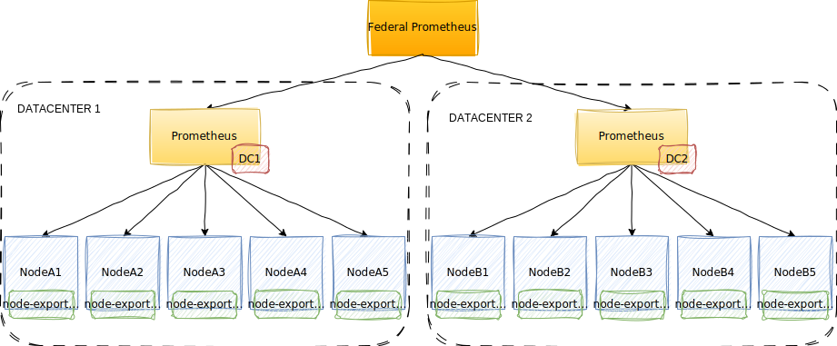

## 4eme partie : fédération de prometheus

## Objectifs

* Déployer **2 instances Prometheus** indépendantes (PromA, PromB) qui scrutent chacune un exporteur (node_exporter ou équivalent).
* Déployer une **troisième instance Prometheus** (PromFed) qui **fédère** les métriques depuis PromA et PromB via leur endpoint `/federate`.
* Vérifier la bonne fédération, écrire quelques règles d'enregistrement et d'alerte simples, et tester des requêtes PromQL pour valider la topologie.

> Commandes `docker run` et fichiers `prometheus.yml` fournis.

---

## Architecture (schéma)



---

## Prérequis

* Docker installé et opérationnel.
* Ports libres : `9090`, `9091`, `9092`, `9100`, `9101`.
* Dossier local de travail (ex : `~/formation-prometheus`).

---

## Arborescence recommandée

```
formation-prometheus/
├─ promA/
│  └─ prometheus.yml
├─ promB/
│  └─ prometheus.yml
└─ promFed/
   └─ prometheus.yml
```

---

## Étape 1 — Lancer deux node exporters ou autres exporters

Déployer deux exporters

```bash
# node exporter 1 -> 9100
docker run -d --name node_exp_1 -p 9100:9100 prom/node-exporter

# node exporter 2 -> 9101
docker run -d --name node_exp_2 -p 9101:9100 prom/node-exporter
```

Ou bien, démarrer un petit serveur HTTP qui expose `/metrics` (ex : app6 du TP6).

---

## Étape 2 — Fichiers de configuration `prometheus.yml`

### `promA/prometheus.yml` (Prometheus A — port 9090)

```yaml
global:
  scrape_interval: 5s

scrape_configs:
  - job_name: 'node_exp_a'
    static_configs:
      - targets: ['ip:port'] # Adapter en fonction de la cible

```

### `promB/prometheus.yml` (Prometheus B — port 9091)

```yaml
global:
  scrape_interval: 5s

scrape_configs:
  - job_name: 'node_exp_b'
    static_configs:
      - targets: ['ip:port'] # Adapter en fonction de la cible
```

### `promFed/prometheus.yml` (Prometheus de fédération — port 9092)

```yaml
global:
  scrape_interval: 5s

scrape_configs:
  - job_name: 'federate_promA'
    metrics_path: '/federate'
    params:
      # règle de filtrage : on récupère toutes les métriques (=> match[]=.*) ou filtrer par nom
      match[]: ['{__name__=~".+"}']
    static_configs:
      - targets: ['ip_promA:9090']  # PromA - adapter ip

  - job_name: 'federate_promB'
    metrics_path: '/federate'
    params:
      match[]: ['{__name__=~".+"}']
    static_configs:
      - targets: ['ip_promB:9091']  # PromB - adapter ip
```

**Remarques** :

* `metrics_path: /federate` est le point d'entrée Prometheus pour la fédération.
* `params.match[]` permet de filtrer les métriques renvoyées. Ici `".+"` = toutes les métriques. En production, préférez des expressions ciblées (ex: `^{job="node"}...`) pour limiter la charge.
* `host.docker.internal` fonctionne sur Docker Desktop (mac/win). Sur Linux, remplacez par `localhost` ou IP de la machine ou docker network.

## Étape 3 — Vérifications de base

1. Accéder aux interfaces web :

   * PromA : `http://localhost:9090/targets`
   * PromB : `http://localhost:9091/targets`
   * PromFed : `http://localhost:9092/targets`

2. Sur chaque page `/targets`, vérifier que les targets (node_exporter, ou les prometheus endpoints) sont **UP**.

3. Vérifier que PromFed a des targets `federate_promA` et `federate_promB` et qu'elles répondent.

4. Exécuter des requêtes PromQL dans PromFed (`http://localhost:9092/graph`), exemples :

   * `up` — voir la liste des targets connues par PromFed (après fédération vous verrez `up{instance="...:9100",job="node_exp_a"}` si la métrique a été transmise).
   * `count(up{job=~"node_exp_.*"})` — nombre d'instances `node_exp`.
   * `rate(node_cpu_seconds_total[5m])` — si vos exporters exposent cette métrique.

---

## Tests pratiques à effectuer

* Arrêtez `node_exp_1` (`docker stop node_exp_1`). Sur PromA `/targets` passe DOWN ; après quelques secondes, sur PromFed la série `up{instance="...:9100"}` doit disparaître ou passer à 0 selon match.

### Grafana

Configurer promFed comme source de données dans grafana, et créer (ou importer) un dashboard.
